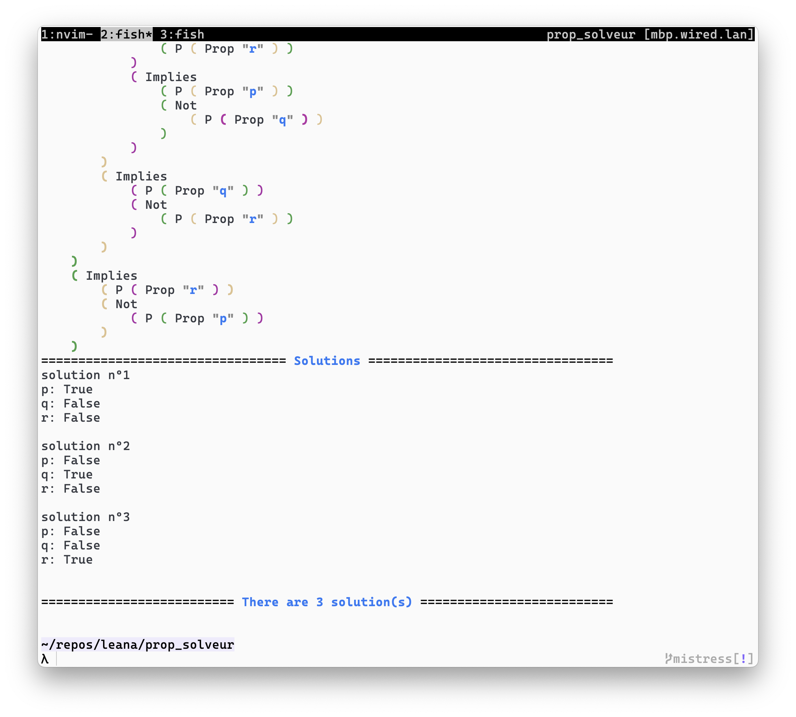

# About
This project is made to implement a simple solver that, given a formula $f$, finds all combinations of propositional variables that set $f$ to true.

# Inner workings
A TL;DR for the logic is that, we enumarete all possible valuations of a formula and evaluates the given formula for each valuation. We then filter out those that evaluates to false.  
This is an exponential operation, more sophisticated heuristics are planned to be implemented (I'm yet to learn them).

# Execution
1. Install `stack` with your favorite package manager.
2. Run `stack run` to execute the program.

# Read from file
Use `stack run -- -f path/to/file` to run with file as input.

# Installation
If you want to use this tool anywhere, simply do `stack install .`.

Have fun :)
